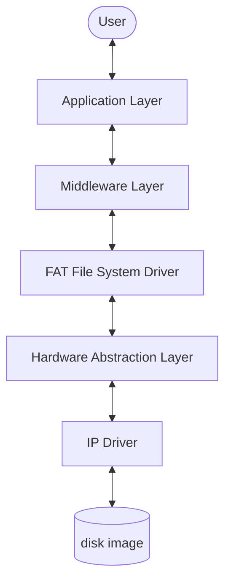
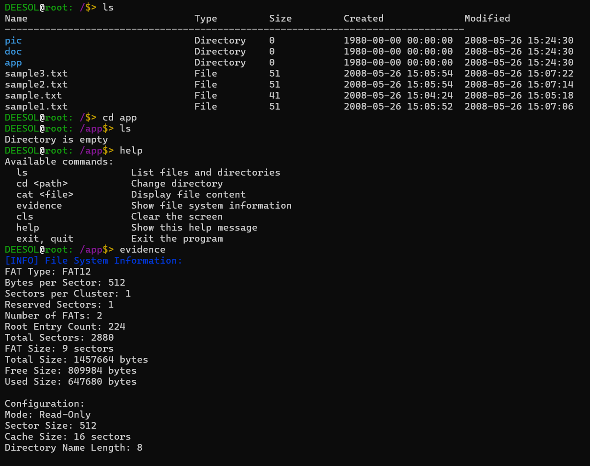
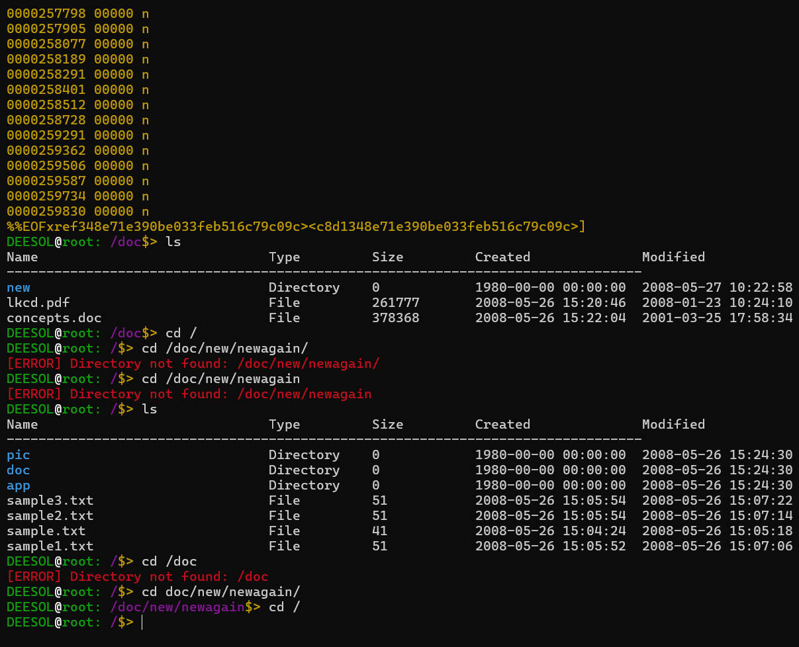
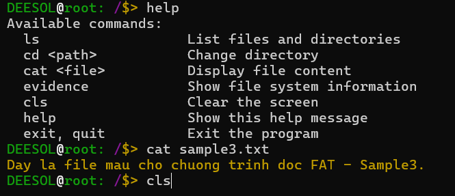

# FAT File System Implementation

[](https://en.wikipedia.org/wiki/C11_(C_standard_revision))
[](https://www.gnu.org/software/make/)
[]()
[]()

[Vietnamese Version / Phien ban Tieng Viet](Readme_vi.md)

---

## Abstract

This project is a userspace C implementation of a FAT file system explorer for Windows/Linux. It simulates low-level storage access by treating a raw disk image, such as `floppy.img`, as a physical device.

The main goal is to demonstrate driver architecture, layered design, and raw filesystem manipulation without relying on the host operating system filesystem driver.

## Welcome / Project Introduction

**FAT File System Explorer** is a personal C project for reading, browsing, and analyzing FAT disk images and ESP-IDF FATFS partition dumps. It combines a terminal-style interface with a layered driver architecture so storage behavior remains explicit and easy to inspect.

Content from the previous `Welcome.md` and `Welcome.ini` files has been merged here:

- Terminal workflow with familiar commands such as `ls`, `cd`, `cat`, `help`, and `evidence`.
- FAT image exploration for learning, debugging, recovery, and filesystem structure inspection.
- Layered implementation: IP Driver, HAL, FAT Driver, Middleware, and Application.
- Build and run automation through shell scripts and Makefile targets.
- Runtime configuration for image selection, build flags, COM port, chip type, baud rate, flash read address, read size, and output file.

Shell and flash-read settings now share one root config file: `shell_config.cfg`.

---

## Table of Contents

- [Welcome / Project Introduction](#welcome--project-introduction)
- [Architecture](#architecture)
- [Project Structure](#project-structure)
- [Component Details](#component-details)
- [Building and Running](#building-and-running)
- [Configuration](#configuration)
- [Screenshots](#screenshots)
- [License](#license)

---

## Architecture



Data flow:

1. Application receives a user command, for example `cat file.txt`.
2. Middleware validates and coordinates the request.
3. FAT Driver parses the boot sector, FAT table, root directory, and cluster chain.
4. HAL maps logical sector access to physical image offsets.
5. IP Driver performs raw `fseek`, `fread`, and `fwrite` operations on the image file.

---

## Project Structure

```text
Project Root
|-- build/              # Build artifacts
|-- images/             # Disk images
|-- src/
|   |-- application/    # CLI and user interface
|   |-- middleware/     # Command and display data handling
|   |-- fat_driver/     # FAT logic
|   |-- hal/            # Sector-to-offset translation
|   |-- ip_driver/      # Raw file I/O
|   |-- common/         # Shared types
|   `-- utilities/      # Linked list, logger, helpers
|-- shell_config.cfg    # Single shell and flash-read config
|-- Makefile
`-- Readme.md
```

---

## Component Details

### IP Driver

Opens, closes, reads, and writes raw bytes in the image file.

### Hardware Abstraction Layer

Maps sector operations to byte offsets. HAL also detects and handles ESP-IDF wear-levelled FATFS images when the metadata is present.

### FAT Driver

Parses FAT structures, manages cluster chains, directory entries, and file operations.

### Middleware and Application

Middleware converts driver data into readable output. Application provides shell commands such as `ls`, `cd`, `cat`, `help`, and `evidence`.

---

## Building and Running

### Prerequisites

- GCC, MinGW on Windows or native GCC on Linux.
- Make or mingw32-make.

### Build

```bash
make release
make debug
make clean
```

### Run

```bash
make run
```

Or run directly:

```bash
./build/bin/main.exe images/floppy.img
```

---

## Configuration

Runtime settings are stored in the root `shell_config.cfg` file. The shell menu updates this file, and the COM-port helper writes detected ports to the `available_com_ports` key in the same file.

Main menu option `9. Load Flash` reads flash with the configured parameters and writes the dump to `output_file`, which defaults to `project/images/storage_dump.bin`.

`menu_theme` controls selection style: `number` uses typed menu numbers, while `arrow` uses Up/Down and Enter.

```cfg
auto_build=disabled
auto_run=disabled
auto_clean=enabled
img_num=7
menu_theme=number

com_port=COM6
available_com_ports=COM6
chip=auto
baud_rate=115200
start_address=0x0
size=0xE70000
output_file=project/images/storage_dump.bin
```

---

## Screenshots

| Directory listing (`ls`) | File content (`cat`) |
|:------------------------:|:--------------------:|
|  |  |



---

## License

This project is released under the MIT License.
