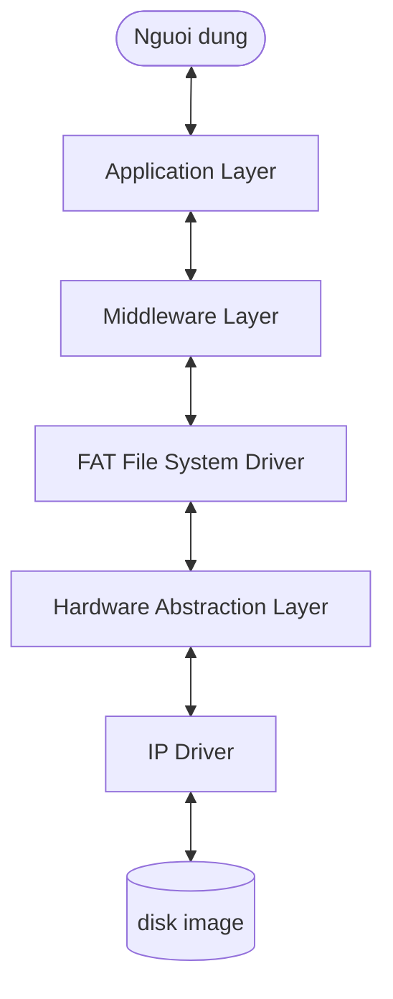

# Trien khai He thong Tep FAT

[](https://en.wikipedia.org/wiki/C11_(C_standard_revision))
[](https://www.gnu.org/software/make/)
[]()
[]()

[English Version / Phien ban Tieng Anh](Readme.md)

---

## Tom tat

Du an nay la mot ban trien khai he thong tep FAT bang ngon ngu C o tang nguoi dung, duoc thiet ke de chay tren Windows/Linux. No mo phong tuong tac phan cung cap thap bang cach coi file anh dia tho nhu mot thiet bi luu tru vat ly.

Muc tieu chinh la minh hoa kien truc driver, thiet ke phan tang, va thao tac filesystem tho ma khong phu thuoc vao driver filesystem cua host OS.

## Gioi thieu du an

**FAT File System Explorer** la du an C ca nhan de doc, duyet, va phan tich cac file anh FAT nhu `floppy.img` hoac ban dump phan vung FATFS cua ESP-IDF. Du an ket hop giao dien terminal voi kien truc driver phan tang, giup viec kiem tra hanh vi luu tru ro rang va de mo rong.

Noi dung tu hai file `Welcome.md` va `Welcome.ini` da duoc gom vao README:

- Lam viec bang terminal voi cac lenh quen thuoc nhu `ls`, `cd`, `cat`, `help`, va `evidence`.
- Duyet va phan tich image FAT phuc vu hoc tap, debug, khoi phuc du lieu, va kiem tra cau truc filesystem.
- Kien truc gom IP Driver, HAL, FAT Driver, Middleware, va Application.
- Tu dong hoa build/run bang shell scripts va Makefile.
- Cau hinh runtime gom image selection, build flags, COM port, chip, baud rate, dia chi doc flash, kich thuoc doc, va file output.

Tat ca cau hinh shell va doc flash hien dung chung mot file goc: `shell_config.cfg`.

---

## Muc luc

- [Kien truc](#kien-truc)
- [Cau truc du an](#cau-truc-du-an)
- [Thanh phan](#thanh-phan)
- [Bien dich va chay](#bien-dich-va-chay)
- [Cau hinh](#cau-hinh)
- [Hinh anh](#hinh-anh)

---

## Kien truc



Luon du lieu:

1. Application nhan lenh nguoi dung, vi du `cat file.txt`.
2. Middleware xac thuc va dieu phoi yeu cau.
3. FAT Driver doc boot sector, FAT table, root directory, va cluster chain.
4. HAL chuyen sector logic thanh offset vat ly.
5. IP Driver thuc hien `fseek`, `fread`, va `fwrite` tren file image.

---

## Cau truc du an

```text
Project Root
|-- build/              # Build artifacts
|-- images/             # Disk images
|-- src/
|   |-- application/    # CLI va giao dien nguoi dung
|   |-- middleware/     # Xu ly lenh va du lieu hien thi
|   |-- fat_driver/     # Logic FAT
|   |-- hal/            # Chuyen sector sang offset
|   |-- ip_driver/      # File I/O tho
|   |-- common/         # Kieu du lieu chung
|   `-- utilities/      # Linked list, logger, helper
|-- shell_config.cfg    # Cau hinh shell va flash read duy nhat
|-- Makefile
`-- Readme.md
```

---

## Thanh phan

### IP Driver

Mo, dong, doc, va ghi byte tho tren file image.

### HAL

Chuyen truy cap sector thanh offset trong file image. HAL cung phat hien va xu ly ESP-IDF wear-levelling FATFS image khi co du lieu phu hop.

### FAT Driver

Doc cau truc FAT, quan ly cluster chain, directory entry, va thao tac file.

### Middleware va Application

Middleware chuyen du lieu driver thanh output de doc. Application cung cap shell lenh nhu `ls`, `cd`, `cat`, `help`, va `evidence`.

---

## Bien dich va chay

### Yeu cau

- GCC, MinGW tren Windows hoac GCC native tren Linux.
- Make hoac mingw32-make.

### Bien dich

```bash
make release
make debug
make clean
```

### Chay

```bash
make run
```

Hoac chay truc tiep:

```bash
./build/bin/main.exe images/floppy.img
```

---

## Cau hinh

Runtime settings duoc luu trong file `shell_config.cfg` o thu muc goc. Shell menu cap nhat file nay, va cong cu quet COM ghi danh sach port tim duoc vao key `available_com_ports` trong cung file.

Main menu option `9. Load Flash` doc flash bang tham so trong config va ghi dump vao `output_file`, mac dinh la `project/images/storage_dump.bin`.

`menu_theme` dieu khien kieu chon menu: `number` la nhap so, `arrow` la dung phim len/xuong va Enter.

```cfg
auto_build=disabled
auto_run=disabled
auto_clean=enabled
img_num=7
menu_theme=number

com_port=COM6
available_com_ports=COM6
chip=auto
baud_rate=115200
start_address=0x0
size=0xE70000
output_file=project/images/storage_dump.bin
```

---

## Hinh anh

| Liet ke thu muc (`ls`) | Noi dung file (`cat`) |
|:----------------------:|:---------------------:|
|  |  |


---

## Giay phep

Du an phat hanh theo giay phep MIT.
